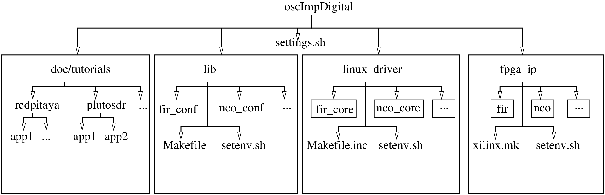

# oscimpDigital
OscillatorIMP ecosystem originally designed for the digital characterization of ultrastable
oscillators, provides most frontend processing blocks for Software Defined Radio (SDR) reception.

## Motivation

This ecosystem aims at providing a consistent software/hardware, chip independent
(Xilinx Zynq, Altera/Intel Cyclone V soc, ... including the 
[Redpitaya STEM 125-14](https://www.redpitaya.com/f130/STEMlab-board) and
[Redpitaya SDRlab 122-16](https://www.redpitaya.com/p52/sdrlab-122-16-standard-kit) boards) solution, to assemble and build
designs targeted for FPGA and to generate and cross-compile software, running
on the CPU running embedded GNU/Linux, dedicated to communicate/configure
logic parts. The highlights of oscimpDigital were presented at the [European GNU Radio Days 2019](https://youtu.be/fQgIJl7vu2s), [Maker Space conference](https://www.youtube.com/watch?v=SSzR_pnZnjs&feature=youtu.be) in 2019 and [FOSDEM](https://fosdem.org/2020/schedule/event/fsr_platform_independent_cpu_fpga_co_design/) in 2020.

The assumption underlying all IP block design is a pipelined stream of data 
processed at each clock cycle, with no latencies introduced by FIFOs between blocks.

The tree structure of the project aims at clearly separating the FPGA IPs, Linux kernel modules, userspace libraries 
and documentation:

 

## Install

This repository is composed of multiple associated submodules (see sub-READMEs
to see each repository goal). Please refer to the [Wiki](https://github.com/oscimp/oscimpDigital/wiki) for pre-requisites and most significantly Buildroot. Vendor specific tools for synthetizing for the targeted FPGA are also assumed to be functional and accessible through the PATH. A **detailed description** of the installation steps for various boards
is available at [the Wiki page](https://github.com/oscimp/oscimpDigital/wiki). The case of the Redpitaya STEM 125-14 is
detailed at the bottom of the page.

### Download

To download this repository and submodules in one command, you need to use
```bash
git clone --recursive https://github.com/oscimp/oscimpDigital.git
```

Or
```bash
git clone https://github.com/oscimp/oscimpDigital.git
cd oscimpDigital
git submodule init
git submodule update
```
to 1/ clone oscimpDigital and 2/ add submodule contents.

### Update

To update repositories you need to use
```bash
git pull
git submodule update
```

## Software environnement

Current Vivado version: 2018.2 to 2019.2

Software parts (applications, libraries and drivers), based on a set of
*Makefile*, uses [buildroot](http://www.buildroot.org) to cross-compiles code.

Thus, you need to download, build and flash your board with a *buildroot*
version configured to your target hardware.

For the specific case of the *Redpitaya* board, not officially supported by
*buildroot*, see
[red_readme](https://github.com/trabucayre/redpitaya/blob/master/README.md)

For the specific case of the *PlutoSDR* board, not officially supported by 
*buildroot*, see [plutosdr_readme](https://github.com/oscimp/PlutoSDR/blob/master/README.md)

## Configuration

The OscillatorIMP ecosystem uses shell environment variables to locate each
repository (*lib*, *fpga_ip*, *linux_driver* and *app*) to allow
In or Out Tree access. In addition to these variables, two other variables are
mandatory to know the target board and the *buildroot* root absolute path for
cross-compilation. 

A sample script (*settings.sh.sample*) is proposed as reference to provide a
complete variable set. You must copy this file and adapt its content to your
specific case, mainly filling the fields:
- *BOARD_NAME*: with the name of your board (*redpitaya*, *redpitaya16*, *plutosdr*, *de0nanosoc* *zedboard* as described in the comment at the beginning of the configuration file). This
variable will be used to determine subdirectories of NFS root, to build designs and run Makefiles accordingly.
- *BR_DIR*: with the absolute path of your *buildroot*. this information is
mandatory to have access to the cross-compiler, linux tree and some other
applications. See above the Software environnement section on how to install buildroot if needed.
- *OSCIMP_DIGITAL_NFS* (optional): when you use *make install* for a Linux driver
or an application, files are copied to a sub-directory of *$OSCIMP_DIGITAL_NFS/$BOARD_NAME*.
By default *OSCIMP_DIGITAL_NFS=/nfs*. Change this variable if you want to
install files in other location.

Once this file has been filled and named *settings.sh*, the command:
```bash
source /somewhere/settings.sh
```
will add these variables to the current environment.

**Warning**: the previous command will add variables only to the current
terminal. To make this setting permanent, the script sourcing must be added
in the user's *~/.bashrc*.

## How it compares with existing solutions ?

Various FPGA design frameworks have been available. Here we list the reasons for pursuing this particular approach of close FPGA/Linux module/GNULinux userspace codesign with respect to other approaches:
- the proprietary approach: of course Xilinx (Vivado) & Altera/Intel (Quartus) provide ready made blackbox solutions to FPGA programming. If you want a vendor-locked solution, these are probably the best alternatives. We want to invest in vendor independent solution that will allow to deploy the framework on any field programmable gate arrays, whether from current (Xilinx/Altera-Intel/Lattice-Microsemi) or future vendors
- Ettus Research has developed RFNOC, an excellent tool for their board but hardly portable to any other platform. A fixed bitstream allows routing packets amongst a fixed set of IPs, as opposed to the proposed approach of a close co-design between the IPs needed for a given design and the associated Linux tools (kernel space and userspace) generated for each new design.
- HLS (High-level Language Synthesis): at the moment most HLS designs require FIFOs and are not compatible with high throughput
streaming data processing, as considered in the radiofrequency data processing for software defined radio
- Migen/Mikymist/ARTIQ (M-Lab)

## [Getting started](https://github.com/oscimp/oscimpDigital/wiki/0Getting-started)


