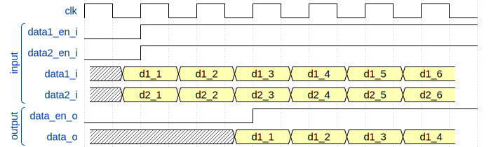

# MUXrealNto1 and MUXcomplexNto1

this IP selects one out of N(max. 32) input streams as configured from the processor
and outputs a single stream. Input and output are either real or complex data
streams.



__Figure1__: MUXNto1 configured to output datastream 0

## IP

**MUXrealNto1** and **MUXcomplexNto1**

## Generic
* **INPUTS** (positive range 1 to 32) number of input data streams multiplexed (default 4).
* default input is always 0.
* **DATA_SIZE**: (natural) output data stream bus size (default: 16).

## Ports and interfaces
* **s00_axi**: (aximm interface) AXI 4 lite bus connected to the CPU
* **s00_axi_reset**: (reset interface) active high reset signal, synchronous to s00_axi. Used for
  AXI communication part.
* **s00_axi_aclk**: (clock interface) clock signal, synchronous to s00_axi. Used for
  AXI communication part.
* **data1_i**: (real or complex interface) input 1 data stream
* **data2_i**: (real or complex interface) input 2 data stream
...
* **dataN_i**: (real or complex interface) input N data stream

## Registers

__**REG_ID**__ (*BASE_ADDR + 0x00*)


__**REG_INPUT**__ (*BASE_ADDR + 0x04*)


## TCL instanciation and connection

### common

```tcl
# add MUXrealNto1 with
set MUXrealNto1 [create_bd_cell -type ip -vlnv ggm:cogen:MUXrealNto1:1.0 MUXrealNto1]
set_property -dict [ list \
    CONFIG.DATA_SIZE 16 \
	CONFIG.DEFAULT_INPUT 0 ] $MUXrealNto1

# interconnect
# MUX data output -> next 1
connect_bd_intf_net [get_bd_intf_pins $MUXrealNto1/data_o] \
    [get_bd_intf_pins $nextInst1/data_in]
# pre 1 -> MUX data input 0
connect_bd_intf_net [get_bd_intf_pins $MUXrealNto1/data1_i] \
    [get_bd_intf_pins $preInst1/data_out]
# pre 2 -> MUX data input 1
connect_bd_intf_net [get_bd_intf_pins $MUXrealNto1/data2_i] \
    [get_bd_intf_pins $preInst2/data_out]

# connect AXI bus
apply_bd_automation -rule xilinx.com:bd_rule:axi4 \
    -config {Master "/processing_system7_0/M_AXI_GP0" Clk "Auto" } \
    [get_bd_intf_pins $MUXrealNto1/s00_axi]
```
## Driver

**switch_core**

Access is done by ioctl:

* **SWITCH_SELECT_INPUT** to select input stream connected to output.

**Example**

```c
#include <switch_core/switch_config.h>

/* ... */

int val;
/* open device */
int fd = open("/dev/switch", O_RDWR);
if (fd < 0) {
	/* do something */
	return;
}

/* select input channel: 0 or 1 */
val = 0; 
ioctl(fd, SWITCH_SELECT_INPUT, &val);

/* close device */
close(fd);

```

## Functions to configure IP

located in switch_conf.c, switch_conf.h

### To select input stream
```c
int switch_send_conf(char *filename, int input);
```
**param**

* *filename*: device filename (*/dev/something*)
* *input*: selected input stream;

**return**

* 0 if filename exists and register has been accessed successfully;
* negative number if something went wrong

example:

```c

#include <switch_conf.h>

/* SNIP */

int ret;
 /* select input 0
 */
ret = switch_send_conf("/dev/switch", 0);
if (ret != 0) {
	/* do something */
	return;
}
```
