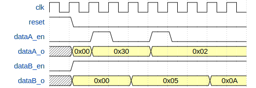
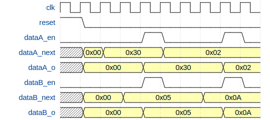

# axi_to_dac

this IP is used to generate two scalar constant as data stream source.
Each output are independtly sets from the CPU.

* each output is packaged in an real interface
* by default the enable signal, contained in interface, goes high for one
  clock cycle when user write a new value to the corresponding register. This
  behaviour may be changed by setting *DATAX_EN_ALWAYS_HIGH* to true at the
  design time or by setting corresponding bits in *CONF* register at the
  run-time (see fig. 1).
* by default each output channel value is fixed independtly, but it's possible to
  synchronize all of them to update output at the same time. This configuration
  may be done, at the design time, by setting *SYNCHRONIZE_CHAN* to true or, at
  runtime, by setting bit 0 in *CONF* register . When IP is
  configured to have synchronous output, the user must write in dataA and dataB
  register in this order to update both channels (see fig. 2).



__Figure1__: axi_to_dac configured to have dataA enable high only when data is
updated and dataB enable always high



__Figure2__: axi_to_dac configured with synchronous channels. dataA is slave of
dataB, so internal register is updated as soon as register is written, but
output is updated at the same time dataB is updated.

## IP

**axi_to_dac**

## Generic

* **DATA_SIZE**: (natural) output data stream bus size (default: 14).
* **DATAA_DEFAULT_OUT**: (integer) default output value for dataA_out (default: 0).
* **DATAA_EN_ALWAYS_HIGH**: (boolean) defines if enable signal, dataA_out
  interface, is high only when a new value is written or always high (default: false).
* **DATAB_DEFAULT_OUT**: (integer) default output value for dataB_out (default: 0).
* **DATAB_EN_ALWAYS_HIGH**: (boolean) defines if enable signal, dataB_out
  interface, is high only when a new value is written or always high (default: false).
* **SYNCHRONIZE_CHAN**:(boolean) defines if all output are updated independtly
  or at the same time (default: false).

## Ports and interfaces
* **s00_axi**: (aximm interface) AXI 4 lite bus connected to the CPU
* **s00_axi_reset**: (reset interface) active high reset signal, synchronous to s00_axi. Used for
  AXI communication part.
* **s00_axi_aclk**: (clock interface) clock signal, synchronous to s00_axi. Used for
  AXI communication part.
* **dataA_out**: (real interface) output A data stream
* **dataB_out**: (real interface) output B data stream
* **ref_rst_i**: (reset interface) active high reset signal, synchronous to
  dataA_out and dataB_out. Used to logic part and shipped in dataA_out and
  dataB_out interfaces.
* **ref_clk_i**: (clock interface) clock signal, synchronous to dataA_out and
  dataB_out. Used to logic part and shipped in dataA_out and dataB_out interfaces.

## Registers

__**REG_ID**__ (*BASE_ADDR + 0x00*)


__**REG_DATAA**__ (*BASE_ADDR + 0x04*)


*Note*: if *DATA_SIZE* < 32, upper bits from this register are discarded to fit *DATA_SIZE* bits

__**REG_DATAB**__ (*BASE_ADDR + 0x08*)


*Note*: if *DATA_SIZE* < 32, upper bits from this register are discarded to fit *DATA_SIZE* bits

__**REG_CONF**__ (*BASE_ADDR + 0x0C*)


| bit  | name       |                        |
|------|------------|------------------------|
| 0    | **SEN**    | *SYNCHRONIZE CHANNELS* |
| 1    | **DAEH**   | *DATA_A_EN_HIGH*       |
| 2    | **DBEH**   | *DATA_B_EN_HIGH*       |
| 31-3 | **unused** |                        |

## TCL instanciation and connection

### common

```tcl
# add axi_to_dac with
# output in 16 bits.
# dataA_out enable always high and dataB_out enable high only when register is
#      written
# dataA_out and dataB_out values updated at the same time
set axi_to_dac[create_bd_cell -type ip -vlnv ggm:cogen:axi_to_dac:1.0 axi_to_dac]
set_property -dict [ list \
    CONFIG.DATA_SIZE 16 \
	CONFIG.DATAA_DEFAULT_OUT 10 \
	CONFIG.DATAA_EN_ALWAYS_HIGH true \
	CONFIG.DATAB_DEFAULT_OUT 20 \
	CONFIG.DATAB_EN_ALWAYS_HIGH false \
	CONFIG.SYNCHRONIZE_CHAN true] $axi_to_dac

# interconnect
# axi_to_dac -> next 1
connect_bd_intf_net [get_bd_intf_pins $axi_to_dac/dataA_out] \
    [get_bd_intf_pins $nextInst1/data_in]
# axi_to_dac -> next 2
connect_bd_intf_net [get_bd_intf_pins $axi_to_dac/dataB_out] \
    [get_bd_intf_pins $nextInst2/data_in]

# CANDR
connect_bd_net [get_bd_pins $clk_src/clk_o] \
	[get_bd_pins $axi_to_dac/ref_clk_i]
connect_bd_net [get_bd_pins $rst_src/rst_o] \
	[get_bd_pins $axi_to_dac/ref_rst_i]

# connect AXI bus
apply_bd_automation -rule xilinx.com:bd_rule:axi4 \
    -config {Master "/processing_system7_0/M_AXI_GP0" Clk "Auto" } \
    [get_bd_intf_pins $axi_to_dac/s00_axi]
```
## Driver

**axi_to_dac_core**

Access is done by ioctl:

* **AXI_TO_DAC_SET(reg)** to write a register;
* **AXI_TO_DAC_GET(reg)** to read a register value.

where reg is:
* **AXI_TO_DAC_ID**: access to reg ID
* **AXI_TO_DAC_DATA_A**: access to reg DATA_A 
* **AXI_TO_DAC_DATA_B**: access to reg DATA_B
* **AXI_TO_DAC_EN_HIGH**: to configure enable behavior. Values allowed:
  * **AXI_TO_DAC_DATAA_EN_HIGH**: dataA enable out is always high and dataB enable out is high when write
  * **AXI_TO_DAC_DATAB_EN_HIGH**: dataA enable out is high when write and dataB enable out is always high
  * **AXI_TO_DAC_BOTH_EN_HIGH**: both output enable are always high
* **AXI_TO_DAC_SYNC_CHAN**: to enable channels synchronization. Allowed values are **AXI_TO_DAC_SYNC_EN** or 0

**Example**

```c
#include <axi_to_dac_core/axi_to_dac_config.h>

/* ... */

int val;
/* open device */
int fd = open("/dev/axi_to_dac", O_RDWR);
if (fd < 0) {
	/* do something */
	return;
}

/* configure sync output */
val = AXI_TO_DAC_SYNC_EN;
ioctl(fd, AXI_TO_DAC_SET(AXI_TO_DAC_SYNC_CHAN), &val);

/* configure data_a oneshot high and data_b enable always high */
val = AXI_TO_DAC_DATAB_EN_HIGH;
/* val = AXI_TO_DAC_DATAA_EN_HIGH; to have opposite */
/* val = AXI_TO_DAC_BOTH_EN_HIGH; to data_a AND data_b enable always_high */
ioctl(fd, AXI_TO_DAC_SET(AXI_TO_DAC_EN_HIGH), &val);

/* write data_a out */
val = 0x0A;
ioctl(fd, AXI_TO_DAC_SET(AXI_TO_DAC_DATA_A), &val);

/* write data_b out */
val = 0x03;
ioctl(fd, AXI_TO_DAC_SET(AXI_TO_DAC_DATA_B), &val);

/* read data_a register value */
ioctl(fd, AXI_TO_DAC_GET(AXI_TO_DAC_DATA_A), &val);

/* close device */
close(fd);

```

## Functions to configure IP

located in axi_to_dac_conf.c, axi_to_dac_conf.h

### To configure all parameters with the same function
```c
int axi_to_dac_full_conf(const char *filename,
         const int32_t chanA_val, const int32_t chanB_val,
         const enum enable_high_t enable_high, uint8_t sync_chan);
```
**param**

* *filename*: device filename (*/dev/something*)
* *chanA_val*: channel A output value;
* *chanB_val*: channel A output value;
* *enable_high*: 
  * *0*: enable for both output are high for one clock cycle when the
  channel is updated by writing to the register;
  * *CHANA_ALWAYS_HIGH*: chan_a enable is always high;
  * *CHANB_ALWAYS_HIGH*: chan_b enable is always high;
  * *BOTH_ALWAYS_HIGH*: chan_a and chan_b enable are always_high.
* *sync_chan*: if set to 0 each channel may be updated independtly. When set to
  1 chanA and chanB reg must be written (in this order) to update both output
  channel

**return**

* 0 if filename exists and register has been accessed successfully;
* negative number if something went wrong

### Set chan output

```c
int axi_to_dac_set_chan(const char *filename, const enum output_chan_t chan,
         const int32_t val);
```
**param**
* *filename*: device filename (*/dev/something*);
* *chan*: wich channel must be updated (CHANA or CHANB);
* *val*: value to write in the corresponding register;

**return**

* 0 if filename exists and register has been accessed successfully;
* negative number if something went wrong

### configure oneshot or continuous mode

```c
int axi_to_dac_conf_enable(const char *filename, const enum enable_high_t enable_high);
```
***param***
* *filename*: device filename (*/dev/something*);
* *enable_high*: see function *axi_to_dac_full_conf* for details.

**return**

* 0 if filename exists and register has been accessed successfully;
* negative number if something went wrong

### configure independant or synchronize channels
```c
int axi_to_dac_conf_sync(const char *filename, const uint8_t sync_chan);
```

***param***
* *filename*: device filename (*/dev/something*);
* *sync_chan*: with 0 chanA or chanB is directly updated when corresponding
  register is written. With 1 chanA and chanB are updated at the same time after
  a write to CHANA_REG and CHANB_REG in this order.

**return**

* 0 if filename exists and register has been accessed successfully;
* negative number if something went wrong

example:

```c

#include <axi_to_dac_conf.h>

/* SNIP */

int ret;
/* first configuration
 * chanA is set to 10
 * chanB is set to 20
 * one shot mode
 * channels are independants
 */
ret = axi_to_dac_full_conf("/dev/axi2dac", 10, 20, 0, 0);
if (ret != 0) {
	/* do something */
	return;
}

/* set chanA to 100 value */
ret = axi_to_dac_set_chan("/dev/axi2dac", CHANA, 100);
if (ret != 0) {
	/* do something */
}

/* set chanA enable always high */
ret = axi_to_dac_conf_enable("/dev/axi2dac", CHANA_ALWAYS_HIGH);
if (ret != 0) {
	/* do something */
}

/* enable synchrone mode */
ret = axi_to_dac_conf_sync("/dev/axi2dac", 1);
if (ret != 0) {
	/* do something */
}

/* update chanA again */
ret = axi_to_dac_set_chan("/dev/axi2dac", CHANA, 20);
if (ret != 0) {
	/* do something */
}
/* at this point chanA output is not updated */

/* update chanB */
ret = axi_to_dac_set_chan("/dev/axi2dac", CHANB, 70);
if (ret != 0) {
	/* do something */
}
/* Now both channels are updated */

```
