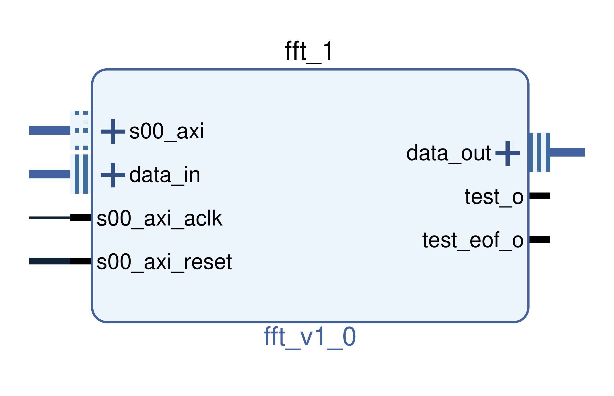

# fft

This IP is a cordic based Fast Fourier Transform algorithm.

<p align="center">

</p>

## Generic

* **LOG_2_N_FFT**: 2**LOG_2_N_FFT = size of the FFT in clock cycles (default 11)
* **SHIFT_VAL**: size of the FFT coefficients (default 16)
* **DATA_SIZE**: output data size (default 32)
* **DATA_IN_SIZE**: input data size (default 16)
* **USE_FIRST_BUFF**: (default true)
* **USE_SEC_BUFF**: (default true)
* **USE_EOF**: To enable the use of the end of frame flag. (default false)

## Ports and interfaces

* **s00_axi**: (aximm interface) AXI 4 lite bus connected to the CPU.
* **s00_axi_reset**: (reset interface) active high reset signal, synchronous to s00_axi. Used for AXI communication part.
* **s00_axi_aclk**: (clock interface) clock signal, synchronous to s00_axi. Used for AXI communication part.
* **data_in**: (real interface) input data stream.
* **data_out**: (complex interface) output data stream.

## Driver

The driver used for the fft IP is **fft_core**.

## Function to configure IP

To configure the fft, use the functions located in fft_conf.c and fft_conf.h:
```c
int fft_send_conf(const char *filename, const char *fileCoeffRe, const char *fileCoeffIm, const int coeffSize);
```

Or for instance in python using python wrapper:
```python
liboscimp_fpga.fft_send_conf("/dev/MY_FFT_IP", "my_real_fft_coefficients.dat", "my_imaginary_fft_coefficients.dat", 2**LOG_2_N_FFT)
```

## Use it!


1/ Make a bitstream. For instance for a fft on 2048 samples, the design **adc -> windowReal -> fft -> dataComplex_to_ram** can be synthetised from the following tcl script:

```tcl
# Create instance: redpitaya_converters_0, and set properties
add_ip_and_conf redpitaya_converters redpitaya_converters_0 {
        ADC_SIZE 14 \
        ADC_EN true \
        DAC_EN true \
        CLOCK_DUTY_CYCLE_STABILIZER_EN true}
connect_to_fpga_pins redpitaya_converters_0 phys_interface phys_interface_0

# redpitaya_converters reset
connect_proc_rst redpitaya_converters_0 adc_rst_i

## Create instance: windowReal_1, and set properties
add_ip_and_conf windowReal windowReal_1 {
        DATA_SIZE 14 \
        COEFF_ADDR_SIZE 11 \
        COEFF_SIZE 16 \
        id 1 }
connect_intf windowReal_1 data_in redpitaya_converters_0 dataA_out
connect_proc windowReal_1 s00_axi 0x00000

## Create instance: fft_1, and set properties
add_ip_and_conf fft fft_1 {
        LOG_2_N_FFT 11 \
        SHIFT_VAL 16 \
        DATA_SIZE 32 \
        DATA_IN_SIZE 14 \
        USE_FIRST_BUFF true \
        USE_SEC_BUFF true \
        USE_EOF true }
connect_intf fft_1 data_in windowReal_1 data_out
connect_proc fft_1 s00_axi 0x10000

## Create instance: dataComplex_to_ram_1, and set properties
add_ip_and_conf dataComplex_to_ram dataComplex_to_ram_1 {
        USE_EOF true \
        NB_INPUT 1 \
        DATA_FORMAT signed \
        DATA_SIZE 32 \
        NB_SAMPLE 2048 }
connect_intf dataComplex_to_ram_1 data1_in fft_1 data_out
connect_proc dataComplex_to_ram_1 s00_axi 0x20000

```

2/ Add the IP fft to your my_project.xml file:

```xml
        <ip name ="fft" >
            <instance name="my_fft_dev_name" id = "0"
                base_addr="0x43XXXXX" addr_size="0xffff" />
        </ip>
```

3/ To cofigure and use the window, see the [windowReal](https://github.com/oscimp/oscimpDigital/blob/master/doc/IP/windowReal.md) IP documentation.

4/ Follow the instructions [here](https://github.com/oscimp/oscimpDigital/wiki/4Testing) to install your bitstream and applications, and run your bitstream. 

5/ Generate the real and imaginary coefficients files for the fft computation. For instance using octave:

```octave
nb_coeff = 2048 ; % here 2048 is an example for 2**LOG_2_N_FFT = 2**11
shift_val = 16 ; % SHIFT_VAL

im(1:nb_coeff/2)=-sin(linspace(0,nb_coeff/2,nb_coeff/2)/nb_coeff*2*pi)*2^shift_val;
im(nb_coeff/2+1:nb_coeff)=0;

re(1:nb_coeff/2)=cos(linspace(0,nb_coeff/2,nb_coeff/2)/nb_coeff*2*pi)*2^shift_val;
re(nb_coeff/2+1:nb_coeff)=0;

csvwrite('fft_im.dat', round(transpose(im)))
csvwrite('fft_re.dat', round(transpose(re)))
```

6/ Load fft window coefficients. From the board, using python:

```python
liboscimp_fpga.fft_send_conf("/dev/my_window_dev_name", "fft_im.dat", "fft_re.dat", 2048)
```

7/ Inject any signal to the input of the board, and use the dataComplex_to_ram to collect the data at the output of the fft block. The end of frame option (USE_EOF set to true) in the fft and dataComplex_to_ram blocks ensures that the FFT is computed on an unfragmented window, and that the buffer of the dataComplex_to_ram corresponds to an unfragmented FFT.  

To send the data from the dataComplex_to_ram to a remote computer, use for instance a python data sender script:

```python
import zmq, time

nb_samples = 2048 # NB_SAMPLE in the dataComplex_to_ram block
data_size = 32 # data size in the dataComplex_to_ram block
nb_channels = 2 # 1 real and 1 imaginary

context = zmq.Context()
sock = context.socket(zmq.PUB)
sock.bind("tcp://*:9901")

while True:
    time.sleep(0.05)
    with open('/dev/dataComplex_to_ram_1', 'rb') as f:
        sock.send(f.read(nb_samples*data_size/8*nb_channels))
```

8/ Plot the FFT. 

Still in preparation :).

9/ Comparison with CPU FFT.

Still in preparation :).
