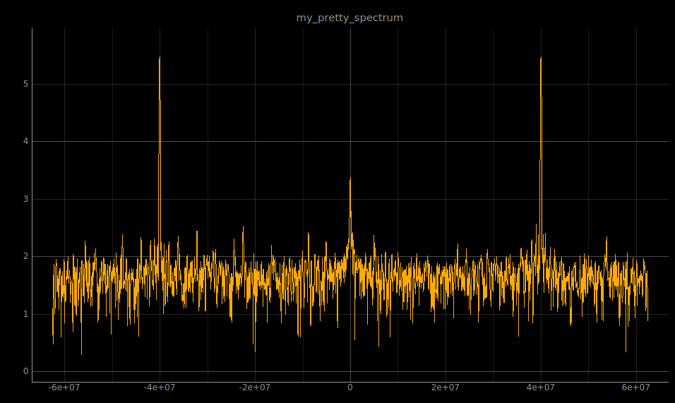

# fir

This IP is a Finite Impulse Response (FIR) filter. Taps (integer coefficients) are read from a file
and do not need to be hardwired upon synthesis. The input can be Real or Complex depending on the
version of the processing block.

<p align="center">

</p>

## Generic

* **NB_COEFF**: tap length (number of coefficients) (default 128)
* **COEFF_SIZE**: tap size (default 16)
* **DECIMATE_FACTOR**: decimation between input and output stream (default 10)
* **DATA_IN_SIZE**: input data size (default 16)
* **DATA_OUT_SIZE**: output data size (default 39)

Be aware that while the FIR internally computes using the theoretical number of bits equal to
``DATA_IN_SIZE+COEFF_SIZE+log2(NB_COEFF)``, setting ``DATA_OUT_SIZE`` to a smaller value will
truncate the **most significant bits**, leading to inconsistent output (noise) if the truncation
is too large. Wisely start with the theoretical output data length and truncate if too many
sign bits are visible.

## Ports and interfaces

* **s00_axi**: (aximm interface) AXI 4 lite bus connected to the CPU.
* **s00_axi_reset**: (reset interface) active high reset signal, synchronous to s00_axi. Used for AXI communication part.
* **s00_axi_aclk**: (clock interface) clock signal, synchronous to s00_axi. Used for AXI communication part.
* **data_in**: (real interface) input data stream.
* **data_out**: (complex interface) output data stream.

## Driver

The driver used for the fir IP is **fir_core**.

## Function to configure IP

To configure the fir, use the functions located in fir_conf.c and fir_conf.h:
```c
int fir_send_conf(const char *filename, const char *fileCoeff, const int coeffSize);
```

## Use it!

1/ Make a bitstream. For instance for a fft on 2048 samples, the design **adc -> windowReal -> fft -> dataComplex_to_ram** can be synthetised from the following tcl script:

<details>
<summary> <strong> See the tcl script! </strong> </summary>

```tcl
## Create instance: redpitaya_converters_0, and set properties
add_ip_and_conf redpitaya_converters redpitaya_converters_0 {
        ADC_SIZE 14 \
        ADC_EN true \
        DAC_EN true \
        CLOCK_DUTY_CYCLE_STABILIZER_EN true}
connect_to_fpga_pins redpitaya_converters_0 phys_interface phys_interface_0

## redpitaya_converters reset
connect_proc_rst redpitaya_converters_0 adc_rst_i

######################################################
#                                                    #
# The above converters are specific to a redpitaya   #
# board, however any device could be used            #
#                                                    #
######################################################


## Create instance: windowReal_1, and set properties
add_ip_and_conf windowReal windowReal_1 {
        DATA_SIZE 14 \
        COEFF_ADDR_SIZE 11 \
        COEFF_SIZE 16 \
        id 1 }
connect_intf windowReal_1 data_in redpitaya_converters_0 dataA_out
connect_proc windowReal_1 s00_axi 0x00000

## Create instance: fft_1, and set properties
add_ip_and_conf fft fft_1 {
        LOG_2_N_FFT 11 \
        SHIFT_VAL 16 \
        DATA_SIZE 32 \
        DATA_IN_SIZE 14 \
        USE_FIRST_BUFF true \
        USE_SEC_BUFF true \
        USE_EOF true }
connect_intf fft_1 data_in windowReal_1 data_out
connect_proc fft_1 s00_axi 0x10000

## Create instance: dataComplex_to_ram_1, and set properties
add_ip_and_conf dataComplex_to_ram dataComplex_to_ram_1 {
        USE_EOF true \
        NB_INPUT 1 \
        DATA_FORMAT signed \
        DATA_SIZE 32 \
        NB_SAMPLE 2048 }
connect_intf dataComplex_to_ram_1 data1_in fft_1 data_out
connect_proc dataComplex_to_ram_1 s00_axi 0x20000

```
</details>

2/ Add the IP fft to your my_project.xml file:

```xml
        <ip name ="fft" >
            <instance name="fft_1" id = "0"
                base_addr="0x43C1000" addr_size="0xffff" />
        </ip>
```

Or generate the xml file from your tcl project: in the tcl directory `make xml`.

3/ To cofigure and use the window, see the [windowReal](https://github.com/oscimp/oscimpDigital/blob/master/doc/IP/windowReal.md) IP documentation.

4/ Follow the instructions [here](https://github.com/oscimp/oscimpDigital/wiki/4Testing) to install your bitstream and applications, and run your bitstream. 

5/ Generate the real and imaginary coefficients files for the FFT computation. For instance using octave:

```octave
nb_coeff = 2048 ; % here 2048 is an example for 2**LOG_2_N_FFT = 2**11
shift_val = 16 ; % SHIFT_VAL

im(1:nb_coeff/2)=-sin(linspace(0,nb_coeff/2,nb_coeff/2)/nb_coeff*2*pi)*2^shift_val;
im(nb_coeff/2+1:nb_coeff)=0;

re(1:nb_coeff/2)=cos(linspace(0,nb_coeff/2,nb_coeff/2)/nb_coeff*2*pi)*2^shift_val;
re(nb_coeff/2+1:nb_coeff)=0;

csvwrite('fft_im.dat', round(transpose(im)))
csvwrite('fft_re.dat', round(transpose(re)))
```

6/ Load the fft coefficients. From the board, using python:

```python
liboscimp_fpga.fft_send_conf("/dev/my_window_dev_name", "fft_im.dat", "fft_re.dat", 2048)
```

7/ Inject any signal to the input of the board, and use the dataComplex_to_ram to collect the data at the output of the fft block. The end of frame option (USE_EOF set to true) in the fft and dataComplex_to_ram blocks ensures that the FFT is computed on an unfragmented window, and that the buffer of the dataComplex_to_ram corresponds to an unfragmented FFT.  

To send the data from the dataComplex_to_ram to a remote computer, use for instance a python data sender script:

<details>
<summary> <strong> See the python sender script! </strong> </summary>

```python
import zmq, time

nb_samples = 2048 # NB_SAMPLE in the dataComplex_to_ram block
data_size = 32 # data size in the dataComplex_to_ram block
nb_channels = 2 # 1 real and 1 imaginary

context = zmq.Context()
sock = context.socket(zmq.PUB)
sock.bind("tcp://*:9901")

while True:
    time.sleep(0.05)
    with open('/dev/dataComplex_to_ram_1', 'rb') as f:
        sock.send(f.read(nb_samples*data_size/8*nb_channels))
```
</details>

8/ Plot the FFT. For this specific application, the python script below makes a live plot of the FFT from the data sent by the board:

<details>
<summary> <strong> See the python receiver/plot script! </strong> </summary>

```python
#!/usr/bin/env python

import zmq, time, numpy, struct, sys, pyqtgraph
from pyqtgraph.Qt import QtCore, QtGui

ip = '138.131.232.155' # ip of the remote board
port = '9901' # port on which is sent the data
dt = 50 # update time (ms)
format = '4096i' # NB_SAMPLE * 2 (real and imaginary) // i for 32 bits int data
freq = 125e6 # sampling frequency of the board

## Communication protocol
context = zmq.Context()
sock = context.socket(zmq.SUB)
sock.setsockopt(zmq.SUBSCRIBE, "".encode('utf-8'))
sock.setsockopt(zmq.CONFLATE,1)
sock.connect("tcp://"+ip+":"+port)

## configure the plot
window = pyqtgraph.GraphicsWindow()
window.setWindowTitle('my_pretty_spectrum IP:'+ip+':'+port)
p = window.addPlot(title='my_pretty_spectrum')
p.showGrid(True,True)
curve = p.plot(pen='y')

def update(freq):
    ## receive the data
    value = struct.unpack(format.encode('utf-8'), sock.recv())
    lendat = len(value[0::2])
    dataRe = value[0::2] # Real part
    dataIm = value[1::2] # Imaginary part
    ## frequency axis
    freq_axis = numpy.linspace(-freq/2, freq/2 , lendat)
    ## compute the spectrum
    spectrum = [numpy.log10(numpy.sqrt(k**2 + j**2)) for k, j in zip(dataRe, dataIm)]
    ## reorder the frequencies
    spectrum = spectrum[lendat/2:] + spectrum[:lendat/2]
    ## update the curve and disable auto range after the first plot
    curve.setData(freq_axis, spectrum, pen=pyqtgraph.mkPen(1, width=1))
    p.enableAutoRange('xy', False)

## update the plot
timer = pyqtgraph.QtCore.QTimer()
timer.timeout.connect(lambda: update(freq))
timer.start(dt)

if (sys.flags.interactive != 1) or not hasattr(QtCore, 'PYQT_VERSION'):
        QtGui.QApplication.instance().exec_()
```
</details>

You are done!

<p align="center">

</p>


## Final notes /!\

- No scale is applied to the output values of the FFT in the example above. If the power level is required in the spectrum plot, a scale must be applied to the output values of the FFT.
- The use of a window changes the peak power estimation. Prefer flattop window function if you have to estimate peak power.
- Keep in mind that this FFT IP works with the FPGA BRAM, that is limited. If a kind of 1 million points FFT is targeted, other solutions may be used: FFT using DMA, sparse FFT algorithm...  
