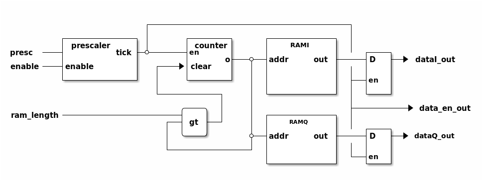

# lutGenerator

this IP is used to generate a stream based on RAM content.
Samples stored into the RAM are not written at synthesis time but at runtime
(may be live updated).

* output rate is fixed by a prescaler
* block may be enabled/disabled
* when last sample is produces, the block restart to the beginning of the RAM
* the burst length is dynamically configured between 1 and the RAM's length



__Figure1__: lutGeneratorComplex configured to have dataA enable high only when data is
updated and dataB enable always high

## IP

**lutGeneratorComplex**

## Generic

* **DATA_SIZE**: (natural) output data stream bus size (default: 16).
* **RAM_DEPTH**: (natural) maximum RAM capacity.
* **PRESCALER_MAX**:(natural) define the maximum value prescaler may have.

## Ports and interfaces
* **s00_axi**: (aximm interface) AXI 4 lite bus connected to the CPU
* **s00_axi_reset**: (reset interface) active high reset signal, synchronous to s00_axi. Used for
  AXI communication part.
* **s00_axi_aclk**: (clock interface) clock signal, synchronous to s00_axi. Used for
  AXI communication part.
* **data_out**: (complex interface) output data stream
* **ref_rst_i**: (reset interface) active high reset signal, synchronous to
  data_out. Used to logic part and shipped in data_out interface.
* **ref_clk_i**: (clock interface) clock signal, synchronous to data_out. Used to clock the logic part
  and shipped in data_out interfaces.

## Registers

__**REG_RAM_LENGTH**__ (*BASE_ADDR + 0x00*)


__**REG_PRESCALER**__ (*BASE_ADDR + 0x04*)


*Note*: if *log2(PRESCALER_MAX)* < 32, upper bits from this register are discarded to fit real length

__**REG_ENABLE**__ (*BASE_ADDR + 0x08*)


__**REG_DATA_I**__ (*BASE_ADDR + 0x0C*)


*Note*: if *DATA_SIZE* < 32, upper bits from this register are discarded to fit *DATA_SIZE* bits

__**REG_DATA_Q**__ (*BASE_ADDR + 0x10*)


*Note*: if *DATA_SIZE* < 32, upper bits from this register are discarded to fit *DATA_SIZE* bits

__**REG_RST_ADDR**__ (*BASE_ADDR + 0x14*)


## TCL instanciation and connection

### common

```tcl
# add lutGeneratorComplex with
# output in 14 bits.
# RAM max capacity of 1024 samples
# a prescaler able to count up to 65535 (2^16 -1)
# instance is also connected to AXI bus at 0x43C0_0000 + 0x0000
# ref_clk and ref_rst are connected to another block (may be zynq,
# redpitaya_converters, ...)

add_ip_and_conf lutGeneratorComplex gene {
    PRESCALER_MAX 65535 \
    DATA_SIZE 14 \
    RAM_DEPTH 1024 }
# AXI interface
connect_proc gene s00_axi 0x0000
# ref CANDR
connect_intf otherBlock clk_o gene ref_clk_i
connect_intf otherBlock rst_o gene ref_rst_i

# output interface is connected to another block input
connect_intf gene data_out otherBlock2 data_in
```

## Driver

**lutGenerator_core**

Access is done by *ioctl*:

* `LUTGENE_SET(reg)` to write a register;
* `LUTGENE_GET(reg)` to read a register value.

where *reg* is:
* `LUTGENE_RAM_LENGTH`: to fix number of sample to read before restarting
  (must be between 1 and `RAM_DEPTH`)
* `LUTGENE_PRESCALER`: to fix prescaler value (must be between 1 (no prescaler)
  and `PRESCALER_MAX`).
* `LUTGENE_ENABLE`: start/stop stream.

RAM content must be sent using `write` function (buffer must be interleaved).

**Example**

```c
#include <lutGene_core/lutGene_config.h>

/* ... */

int val;
/* open device */
int fd = open("/dev/gene", O_RDWR);
if (fd < 0) {
	/* do something */
	return;
}

/* configure number of sample per burst */
val = 50;
ioctl(fd, LUTGENE_SET(LUTGENE_RAM_LENGTH), &val);

/* configure prescaler to two */
val = 2;
ioctl(fd, LUTGENE_SET(LUTGENE_PRESCALER), &val);

/* fill ram */
/* buffer is considerer already filled */
write(fd, buffer, 50 * sizeof(uint32_t));

/* enable stream */
val = 0x01;
ioctl(fd, LUTGENE_SET(LUTGENE_ENABLE), &val);

[...]

/* disable stream */
val = 0x00;
ioctl(fd, LUTGENE_SET(LUTGENE_ENABLE), &val);

/* close device */
close(fd);

```

## Functions to configure IP

located in lutGenerator.c, lutGenerator.h

### To configure RAM and all parameters with the same function

```c
int lutGeneratorComplex_configure(const char *filename,
         const char *fileData,
         const int len,
         const uin8t_t enable,
         const uint32_t prescaler);
```

**param**

* `filename`: device filename (*/dev/something*)
* `fileData`: sample file must be ASCII two columns integer values
* `len`: number of sample to read/send
* `enable`: 1 to enable stream, 0 to disable
* `prescaler`: the prescaler value between 1 and `PRESCALER_MAX`

**return**

* 0 if `filename`, `fileData` exists and registers has been accessed successfully;
* negative number if something went wrong

### Fill the RAM without any other operations
```c

int lutGeneratorComplex_fill_ram(const char *filename,
         const char *fileData,
         const int len);
```

**param**

* `filename`: device filename (*/dev/something*)
* `fileData`: sample file must be ASCII two columns integer values
* `len`: number of sample to read/send

**return**

* 0 if `filename` exists and register has been accessed successfully;
* negative number if something went wrong

### Set prescaler

```c
int lutGenerator_set_prescaler(const char *filename,
         const uint32_t prescaler);
```

**param**

* `filename`: device filename (*/dev/something*)
* `prescaler`: the prescaler value between 1 and `PRESCALER_MAX`

**return**

* 0 if `filename` exists and register has been accessed successfully;
* negative number if something went wrong

### Set LUT length

```c
int lutGenerator_set_ram_length(const char *filename,
         const int len);
```

***param***

* `filename`: device filename (*/dev/something*)
* `len`: number of sample to read/send

**return**

* 0 if `filename` exists and register has been accessed successfully;
* negative number if something went wrong

### Enable/disable output

```c
int lutGenerator_enable(const char *filename,
         const uint8_t enable);
```

***param***

* `filename`: device filename (*/dev/something*)
* `enable`: 1 to enable stream, 0 to disable

**return**

* 0 if `filename` exists and register has been accessed successfully;
* negative number if something went wrong

### **example**

```c

#include <lutGenerator.h>

/* SNIP */

int ret;
/* first configuration
 * RAM content is in "myfile.txt"
 * LUT length is fixed to 128 samples
 * output is enabled
 * the prescaler is configured to 10
 */
ret = lutGeneratorComplex_configure("/dev/gene", "myfile.txt", 128, 1, 10);
if (ret != 0) {
	/* do something */
	return;
}

/* reduce lut length to 64 */
ret = lutGenerator_set_ram_length("/dev/gene", 64);
if (ret != 0) {
	/* do something */
}

/* change prescaler to 2 */
ret = lutGenerator_set_prescaler("/dev/gene", 2);
if (ret != 0) {
	/* do something */
}

/* update RAM with a new content */
ret = lutGeneratorComplex_fill_ram("/dev/gene", "myfile2.txt", 256);
if (ret != 0) {
	/* do something */
}

/* disable output */
ret = lutGenerator_enable("/dev/gene", 0);
if (ret != 0) {
	/* do something */
}

```
