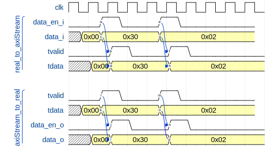
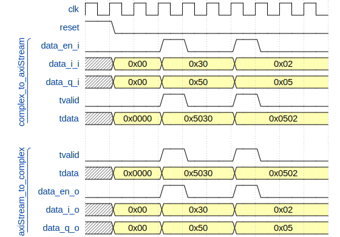

# real or complex to and from Axi Stream

These IPs are used to convert *OscImpDigital* custom interface from and to AXI stream
interface

* converts ENABLE signal to/from TVALID signal
* for real interface converts DATA bus to/from TDATA bus
* for complex interface concatenates DATA_I and DATA_Q to/from TDATA (I component
  in lower bits, Q component in higher bits).



__Figure1__: real_to_axiStream (up) and axiStream_to_real (bottom) internal behavior.
Delay between input and output is to have more readable chronograms, no delays are introduce by these IPs.



__Figure2__: complex_to_axiStream (up) and axiStream_to_complex (bottom) internal behavior

## IP

* **realToAxiStream**: converts a real data stream to an AXI stream
* **complexToAxiStream**: converts a complex data stream to an AXI stream
* **axiStreamToReal**: converts an AXI stream to a real data stream
* **axiStreamToComplex**: converts an AXI stream to a complex data stream

## Generic

**DATA_SIZE**: (natural) data stream bus size (default: 32).

## Ports and interfaces

### XXToAxiStream

* **data_in**: (real interface for realToAxiStream and complex interface for
  complexToAxiStream) input data stream
* **m00_axis_aclk**: (clock interface) clock signal, synchronous to data_in and
  m00_axis
* **m00_axis**: (AXI stream) output data stream (size: DATA_SIZE for real and 2
  x DATA_SIZE for complex).

### axiStreamToXX

* **s00_axis**: (AXI stream) input data stream (size: DATA_SIZE for real and 2 x
  DATA_SIZE for complex)
* **s00_axi_reset**: (reset interface) active high reset signal, synchronous to
  s00_axi. Shipped to the complex/real output interface as reset signal for the rest of
  the chain
* **s00_axi_aclk**: (clock interface) clock signal, synchronous to s00_axi.
  Shipped to the complex/real output interface to clock the rest of the chain
* **data_out**: (complex or real interface) output data stream

## Registers

**NA**

## TCL instanciation and connection

```tcl
# convert an real data stream to AXI stream to use an FIFO to move data from one
# clock domain to an other. 

# real -> axi
set realToAxi [create_bd_cell -type ip -vlnv ggm:cogen:realToAxiStream:1.0 realToAxi]
set_property -dict [ list CONFIG.DATA_SIZE 16 ] $realToAxi

# fifo
set fifo_clk [create_bd_cell -type ip -vlnv xilinx.com:ip:fifo_generator:13.2 fifo_clk]
# ...

# axi -> real
set axiToReal [create_bd_cell -type ip -vlnv ggm:cogen:AxiStreamToReal:1.0 axiToReal]
set_property -dict [ list CONFIG.DATA_SIZE 16 ] $axiToReal

# interconnect
# prev -> realToAxi
connect_bd_intf_net [get_bd_intf_pins $prevInst/data_out] \
    [get_bd_intf_pins $realToAxi/data_in]
# realToAxi -> fifo
connect_bd_intf_net [get_bd_intf_pins $realToAxi/m00_axis] \
    [get_bd_intf_pins $fifo_clk/s00_axis]
# fifo -> axiToReal
connect_bd_intf_net [get_bd_intf_pins $fifo_clk/m00_axis] \
    [get_bd_intf_pins $axiToReal/s00_axis]

# axiToReal -> next
connect_bd_intf_net [get_bd_intf_pins $axiToReal/data_out] \
    [get_bd_intf_pins $nextInst/data_in]

# CANDR
## domain1
connect_bd_net [get_bd_pins $clk_domain1/clk_o] \
	[get_bd_pins $realToAxi/m00_axis_aclk]
connect_bd_net [get_bd_pins $clk_domain1/clk_o] \
	[get_bd_pins $fifo_clk/s_aclk]
## domain2
connect_bd_net [get_bd_pins $clk_domain2/clk_o] \
	[get_bd_pins $axiToReal/s00_axis_aclk]
connect_bd_net [get_bd_pins $rst_domain2/rst_o] \
	[get_bd_pins $axiToReal/s00_axi_reset]
connect_bd_net [get_bd_pins $clk_domain2/clk_o] \
	[get_bd_pins $fifo_clk/m_aclk]
```
## Driver

**NA**

## Functions to configure IP

**NA**
