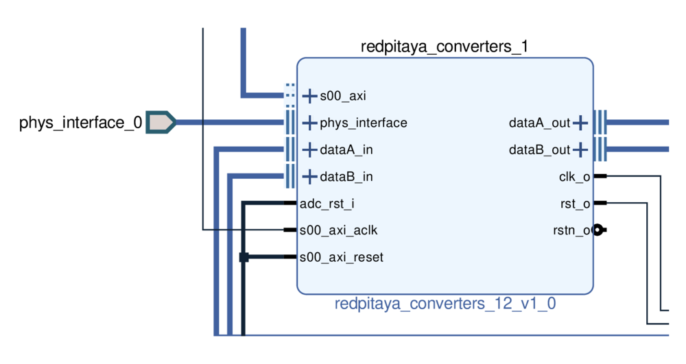

/!\ UNDER TEST

# redpitaya_converters_12

This IP represents the analog to digital and digital to analog converters of the redpitaya STEM250-12 "Signal-lab".
It includes:

* the ADC logic,
* the DAC logic,
* the SPI parametrisation of the converters,
* the clock managment,
* the control of the internal clok with an external 10 MHz reference clock.

<p align="center">

</p>

## Ports and interfaces

* **s00_axi**: (aximm interface) AXI 4 lite bus connected to the CPU
* **s00_axi_reset**: (reset interface) active high reset signal, synchronous to s00_axi. Used for
  AXI communication part.
* **s00_axi_aclk**: (clock interface) clock signal, synchronous to s00_axi. Used for
  AXI communication part.

* **phys_interface**: physical inputs, defined in the constraints files.
* **adc_rst_i**: reset signal.
* **dataA_in**: (real interface) input A data stream going to the DAC A.
* **dataB_in**: (real interface) input B data stream going to the DAC B.

* **dataA_out**: (real interface) output A data stream of ADC A.
* **dataB_out**: (real interface) output B data stream of ADC B.
* **clk_o**: output clock signal.
* **rst_o**: output reset signal.
* **rstn_o**: output inverted reset signal.

## Prerequisite

### Buildroot

This IP is developped for the redpitaya STEM250-12 and requires the corresponding buildroot.
See https://github.com/trabucayre/redpitaya for further informations on the preparation of the buildroot.

Modify the variable devicetree_image in (somewhere)/redpitaya/board/redpitaya/uEnv.txt:

```
devicetree_image=zynq-red_pitaya12.dtb
```

In the buildroot directory: 

```bash
make clean
make redpitaya12_defconfig
make
make menuconfig
#[...]customize your buildroot
make
```

Finally follow the usual protocol: https://github.com/oscimp/oscimpDigital/wiki/2Prepare.

### Zynq

The **ZYNQ7 Processing System** block must also be adapted to the redpitaya STEM250-12 board:

1. Eventually add the Zynq block to your block design.
2. Double click on it.
3. Click on presets, then apply configuration.
4. Choose $OSCIMP_DIGITAL/fpga_ip/preset/redpitaya12.tcl and apply.

Done !

### ADC / DAC power on

The ADC and DAC must be powered on to be used. This is controlled by the GPIO at address 908 for the ADC, and 909 for the DAC.
To power on the converters, type in the redpitaya:

```bash
# ADC
echo 908 > /sys/class/gpio/export
echo out > /sys/class/gpio/gpio908/direction
echo 1 > /sys/class/gpio/gpio908/value
echo 908 > /sys/class/gpio/unexport

# DAC
echo 909 > /sys/class/gpio/export
echo out > /sys/class/gpio/gpio909/direction
echo 1 > /sys/class/gpio/gpio909/value
echo 909 > /sys/class/gpio/unexport
```

## Use it !

### In the block design:

1. Add the IP to your block design.
2. Include the constraints files:
	- right click on Sources/Constraits,
	- then Add sources, Add or Create Constraints,
	- in the next section: Add files,
	- in $OSCIMP_DIGITAL/fpga_ip/redpitaya_converters_12 directory, seelect redpitaya_converters_12.xdc and redpitaya_converters_adc_12.xdc,
	- Finish.
3. Apply the Run Connection Automation proposition.
4. Right click on **phys_interface**, then Make external.
5. Connect **adc_rst_i** to **s00_axi_reset**.

The block is ready to use !

### In my_super_project.xml

The **redpitaya_converters_12** must be included in the xml file attached to the project:

```xml
        <ip name ="redpitaya_converters_12" >
            <instance name="my_converters_dev_name" id = "0"
                base_addr="0x43C30000" addr_size="0xffff" />
        </ip>
```

### SPI configuration of the converters:

The DACs are used with their default configuration, but the ADCs need to be configures using the SPI interface of the converters.

Using python:

```python
from liboscimp_fpga import *
import time

redpitaya_converters_12_spi_conf("/dev/my_converters_dev_name",1,0xff,0x00,1)
redpitaya_converters_12_spi_conf("/dev/my_converters_dev_name",1,0xff,0x00,0)
time.sleep(0.1)
redpitaya_converters_12_spi_conf("/dev/my_converters_dev_name",1,0x14,0x01,1)
redpitaya_converters_12_spi_conf("/dev/my_converters_dev_name",1,0x14,0x01,0)
time.sleep(0.1)
redpitaya_converters_12_spi_conf("/dev/my_converters_dev_name",1,0x16,0xa0,1)
redpitaya_converters_12_spi_conf("/dev/my_converters_dev_name",1,0x16,0xa0,0)
time.sleep(0.1)
redpitaya_converters_12_spi_conf("/dev/my_converters_dev_name",1,0x18,0x1b,1)
redpitaya_converters_12_spi_conf("/dev/my_converters_dev_name",1,0xf8,0x1b,0)
time.sleep(0.1)
redpitaya_converters_12_spi_conf("/dev/my_converters_dev_name",1,0xff,0x01,1)
```

### Enable the referencing of the internal clock with the 10 MHz reference input:

Enable using python:

```python
from liboscimp_fpga import *

redpitaya_converters_12_ext_ref_enable("/dev/my_converters_dev_name", 1)
```

Disable using python:

```python
from liboscimp_fpga import *

redpitaya_converters_12_ext_ref_enable("/dev/my_converters_dev_name", 0)
```

## In the webserver

The webserver generated by the [webserver_generator](https://github.com/oscimp/app/tree/018db59e25a945751b695b22dcb2c51e94388f51/tools/webserver_generator) includes the power on of the converters and ADC configuration. 
It also allows the choice of use of an external reference oscillator, as chown in the following figure: 


<p align="center">

</p>


Althougt the control of the input attenuation, input coupling, and output gain is not part of IP redpitaya_converters_12, 
their control is also made available in the webserver when the IP is mentionned in the xml file attached to the project.
