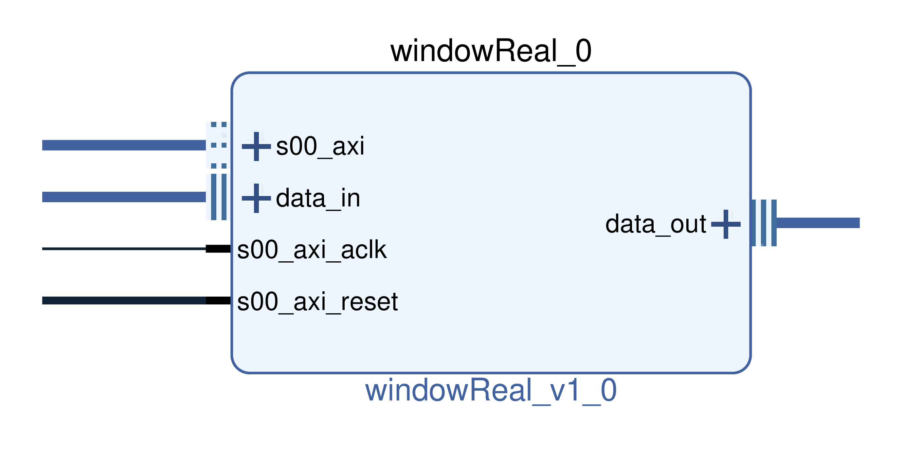
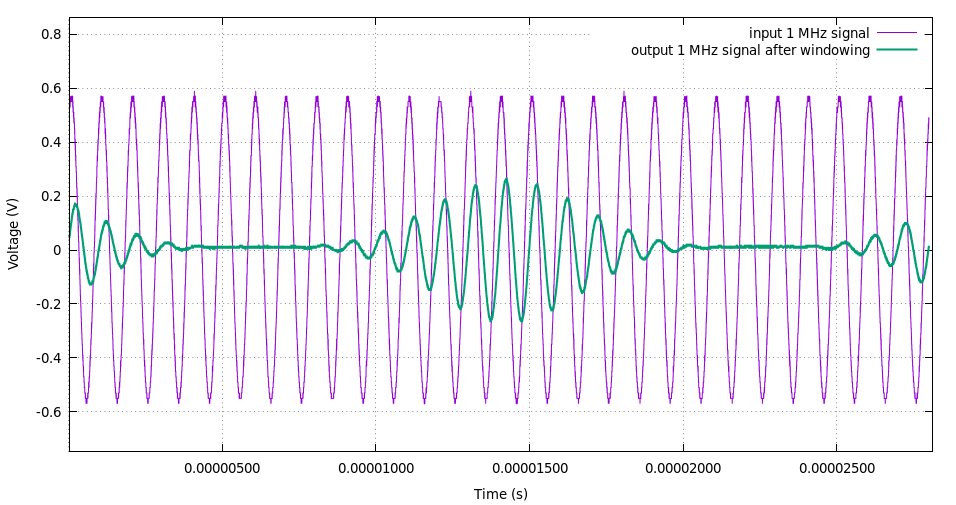

# windowReal

This role of this IP is to multiply a time signal by a time window in order to reduce the noise floor added by signal leakage.

*Be careful*, applying a window function change the peak power estimation. Prefer flattop window function if you have to estimate peak power.

<p align="center">

</p>

## Generic

* **DATA_SIZE**: input/output data size (default 32)
* **COEFF_ADDR_SIZE**: 2**COEFF_ADDR_SIZE = size of the window in clock cycles (default 8)
* **COEFF_SIZE**: window coefficients size (default 16)

## Ports and interfaces

* **s00_axi**: (aximm interface) AXI 4 lite bus connected to the CPU.
* **s00_axi_aclk**: (clock interface) clock signal, synchronous to s00_axi. Used for AXI communication part.
* **s00_axi_reset**: (reset interface) active high reset signal, synchronous to s00_axi. Used for AXI communication part.
* **data_in**: (real interface) input data stream.
* **data_out**: (real interface) output data stream.

## Driver

The driver used for the windowReal IP is the same as the fir driver: **fir_core**

## Function to configure IP

To configure the window, use the functions located in fir_conf.c and fir_conf.h:
```c
int fir_send_conf(const char *filename, const char *fileCoeff, const int coeffSize);
```

Or for instance in python using python wrapper:
```python
liboscimp_fpga.fir_send_conf("/dev/MY_WINDOW_IP", "my_pretty_window.dat", 2**COEFF_ADDR_SIZE)
```

## Use it!


1/ Make a bitstream. For instance with a Redpitaya board: adc -> windowReal -> dac.

2/ Add the IP windowReal to your my_project.xml file:

```xml
        <ip name ="windowReal" >
            <instance name="my_window_dev_name" id = "0"
                base_addr="0x43XXXXX" addr_size="0xffff" />
        </ip>
```

3/ Follow the instructions [here](https://github.com/oscimp/oscimpDigital/wiki/4Testing) to install your bitstream and applications, and run your bitstream.

4/ Generate the coefficients file for the windowing. For instance using octave:

* For a Hanning window:

```octave
nb_coeff = 2048 ; % here 2048 is an example for 2**COEFF_ADDR_SIZE
coeff_size = 16 ; % COEFF_SIZE
csvwrite('hann.dat', round(hanning(nb_coeff)*2^(coeff_size-1))); % generate float coefficients and convert to int16
```

* For a Blackman-Harris window:

```octave
pkg load signal
nb_coeff = 2048 ; % here 2048 is an example for 2**COEFF_ADDR_SIZE
coeff_size = 16 ; % COEFF_SIZE
csvwrite('blackmanharris.dat', round(blackmanharris(nb_coeff)*2^(coeff_size-1))); % generate float coefficients and convert to int16
```

* See [octave signal package man page](https://octave.sourceforge.io/signal/overview.html) for other windowing functions and details.

5/ Load the window coefficients. From the board, using python:

```python
liboscimp_fpga.fir_send_conf("/dev/my_window_dev_name", "blackmanharris.dat", 2048)
```

6/ Inject any signal to the input of the board and connect the output to an oscilloscope. Then observe the window effect:

<p align="center">

</p>

