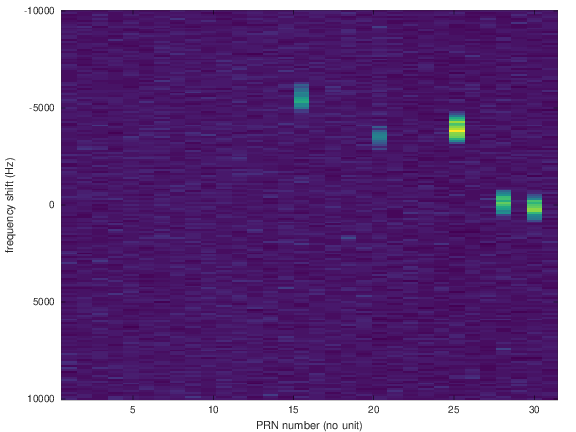

Following the second tutorial, we consider a practical application of performing
some of the computation not taken care of by the AD9363 on the Zynq PL, namely
correlations in a CMDA demonstration.

For those in a hurry, two bitstreams ready for compiling the PlutoSDR DFU image are provided 
in the [images](images) directory. 

The TCL script for generating the final design is available in [design](design). Once the 
synthesis is complete, opening the pluto.xpr file to get back to the initial steps, or editing
the TCL script to add step by step functionalities, allow for following step by step the
tutorial text.

At the end of the tutorial, adding a bias-T and a GPS antenna should allow to process
all space-vehicle PRN pseudo-random sequence for all possible Doppler frequency shifts 
and map the visible satellites as strong correlation peaks as seen below.

See [K.Borre, D.M.Akos, N.Bertelsen, P.Rinder, S.H.Jensen, A Software-Defined GPS and 
Galileo Receiver -- A Single-Frequency Approach, Springer (2007)
](https://www.springer.com/gp/book/9780817643904) for the theoretical background of
CDMA decoding and GPS acquisition phase.
