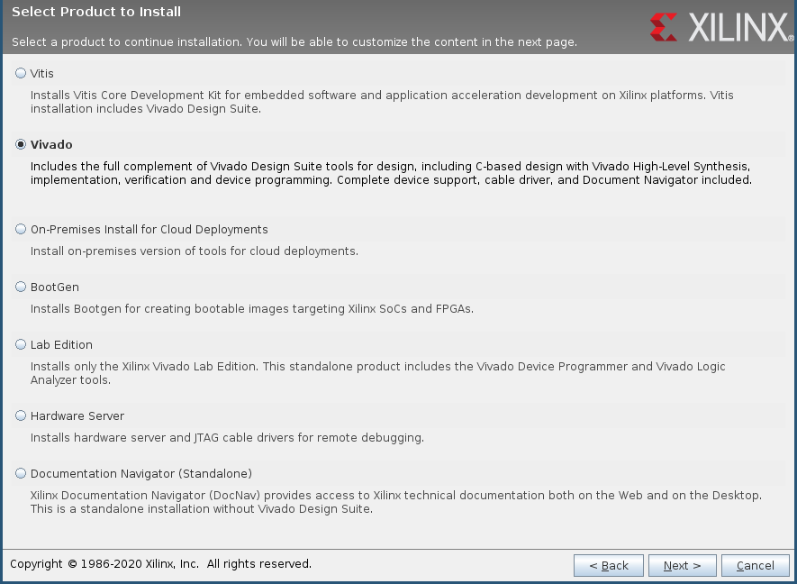
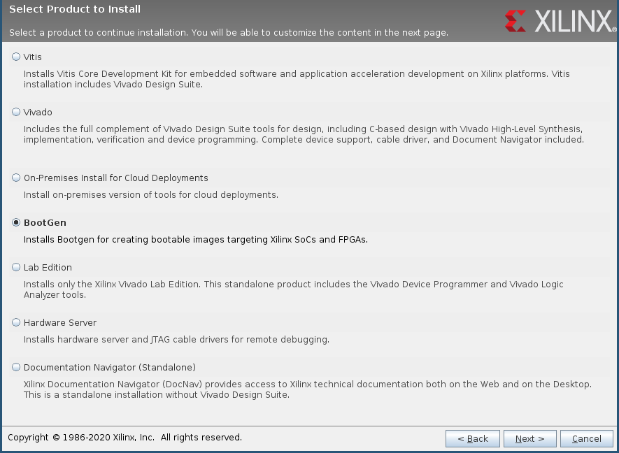

# Getting started with Redpitaya STEM 125-14

We assume the final folder tree will be as following:

```
~
└── git
    ├── buildroot-2019.05.1
    ├── oscimpDigital
    └── redpitaya
```

```
mkdir ~/git
cd ~/git
```

## Prepare a buildroot

Get the lastest version of buildroot compatible:
```
wget https://buildroot.org/downloads/buildroot-2019.05.1.tar.gz
tar -xf buildroot-2019.05.1.tar.gz
```

## Prepare redpitaya support for buildroot

```
git clone https://github.com/trabucayre/redpitaya.git
```

Check the network configuration of the redpitaya in the `redpitaya/boards/redpitaya/overlay/etc/network/interfaces` file.
[Trabucayre's readme](https://github.com/trabucayre/redpitaya/blob/master/README.md#ip-address) contains examples for static interface.

## Get oscimpDigital

```
git clone --recursive https://github.com/oscimp/oscimpDigital.git
```

## Prepare bash environment

Add redpitaya board to buildroot.
```
source redpitaya/sourceme.ggm
```

Create your `oscimpDigital/settings.sh` to link oscimpDigital to buildroot.
```
cp oscimpDigital/settings.sh.sample oscimpDigital/settings.sh
```

Specify your setup with following variables:

`BOARD_NAME='redpitaya'`

`BR_DIR=~/git/buildroot-2019.05.1/`

### Example of `settings.sh`
```bash
# define the board being used. Must be adapted to either:
# plutosdr for the Xilinx Zynq-based ADI PlutoSDR board
# redpitaya for the Xilinx Zynq-based 14-bit legacy Red Pitaya board
# redpitaya16 for the new Xilinx Zynq-based 16-bit Red Pitaya board
# de0nansoc for the Altera/Intel Terrasic DE0Nano SoC
export BOARD_NAME='redpitaya'

#define Buildroot location
export BR_DIR='~/git/buildroot-2019.05.1/'

# define target IP
# 192.168.0.10 for RedPitaya
# 192.168.2.1 for PlutoSDR
export IP=192.168.0.10

#only mandatory for plutosdr
#export ADI_HDL_DIR=

# define where to install apps, drivers, etc
export OSCIMP_DIGITAL_NFS='/nfs'

OSCIMP_DIGITAL=$(cd `dirname "${BASH_SOURCE[0]}"` && pwd)
source $OSCIMP_DIGITAL/app/setenv.sh        # defines $OSCIMP_DIGITAL_APP
source $OSCIMP_DIGITAL/fpga_ip/setenv.sh    # defines OSCIMP_DIGITAL_IP
source $OSCIMP_DIGITAL/lib/setenv.sh        # OSCIMP_DIGITAL_LIB
source $OSCIMP_DIGITAL/linux_driver/setenv.sh

export PATH=$PATH:$OSCIMP_DIGITAL_APP/tools/module_generator:$OSCIMP_DIGITAL_IP/tools/

# /!\ locale settings for Vivado (uses '.' as separator, as opposed to the French ',')
export LANG=en_US.UTF-8
# /!\ check /etc/locale.gen: en_US.UTF-8 UTF-8 must be UNcommented. If it was commented:
#     remove comment and execute as root locale-gen
```

Finnaly
```
source oscimpDigital/settings.sh
```

## Prepare your buildroot

### Configuration

Go to buildroot dir.
```
cd buildroot-2019.05.1
```

Set the default configuration.
```
make redpitaya_defconfig
```

Add optional packages for the specific application.
```
make menuconfig
```

Add python3: `Target packages -> Interpreter languages and scripting  ->[*] python3`

python3-lxml: `Target packages -> Interpreter languages and scripting  -> External python modules  -> [*] python-lxml`

python-pyzmq: `Target packages -> Interpreter languages and scripting  -> External python modules  -> [*] python-pyzmq`

python-remi: `Target packages -> Interpreter languages and scripting  -> External python modules  -> [*] python-remi`

### Make your buildroot base

**WARNING** this command can take several hours according to your internet connection

```
make
```

An image of the sdcard is created in `output/images/sdcard.img`.

## NFS

The drivers and apps are not physically on the redpitaya but on a file server (using NFS protocol).

### NFS server on your PC

As *root*:
```
apt install nfs-kernel-server nfs-common
mkdir /nfs
```

Add `/nfs` to `/ect/exports`:
```
# /etc/exports: the access control list for filesystems which may be exported
#		to NFS clients.  See exports(5).
#
# Example for NFSv2 and NFSv3:
# /srv/homes       hostname1(rw,sync,no_subtree_check) hostname2(ro,sync,no_subtree_check)
#
# Example for NFSv4:
# /srv/nfs4        gss/krb5i(rw,sync,fsid=0,crossmnt,no_subtree_check)
# /srv/nfs4/homes  gss/krb5i(rw,sync,no_subtree_check)
#

/nfs	192.168.0.10(rw,no_root_squash,sync)
```

You can allow a range of ip to acces to your nfs server with a netmask:
```
/nfs    192.168.0.10/255.255.255.0(rw,no_root_squash,sync)
```

### NFS client on redpitaya

Edit the redpitaya's `~/git/redpitaya/board/redpitaya/overlay/etc/fstab` to add the distant folder at the end of the file:
```
192.168.0.1:/nfs /usr/remote nfs defaults,noauto,nolock 0  0
```

And create the `remote` folder on the redpitaya:
```
mkdir ~/git/redpitaya/board/redpitaya/overlay/remote
```

## Build oscimpDigital tools, drivers and lib

Make module_generator:
```
cd ~/git/oscimpDigital/app/tools/module_genetator
make
sudo make install
```

Make libraries:
```
cd ~/git/oscimpDigital/lib
make
make install
```
Add python wrapper to the buildroot overlay:
```
mkdir -p ~/git/redpitaya/board/redpitaya/overlay/usr/lib/python3.7/site-packages/
cp liboscimp_fpga.py ~/git/redpitaya/board/redpitaya/overlay/usr/lib/python3.7/site-packages/
```

Make drivers:
```
cd ~/git/oscimpDigital/linux_driver
make
make install_nfsdir
```

## Make your complete buildroot (really !)

```
cd ~/git/buildroot-2019.05.1
make
```

Insert a sdcard and get its dev name with:
```
lsblk
```

It should be like `/dev/sdX`.

**WARNING** Be sure to correctly identify your sdcard. If not, you could erase your local data.

Extract to sdcard (here, to `/dev/sdb`):
```
sudo dd if=output/images/sdcard.img of=/dev/sdb bs=4M
```

Insert the sdcard on the redpitaya and power on.
The green LED should be on, and the red LED will blink.

Connect to your redpitaya through ssh:
```
ssh root@192.168.0.10
```

or by USB (com connector on redpitaya)
```
minicom -D /dev/ttyUSB0
```

## Install Vivado HL WebPack 2019.2

Download [Vivado 2019.2](https://www.xilinx.com/member/forms/download/xef.html?filename=Xilinx_Unified_2019.2_1106_2127_Lin64.bin)

You need to create a Xilinx account to download Vivado.

Install *Vivado HL WebPack* and *Bootgen*.

As *root*

```
chmod +x Xilinx_Unified_2019.2_1106_2127_Lin64.bin
./Xilinx_Unified_2019.2_1106_2127_Lin64.bin
```






Source your fresh Vivado install

```
source /tools/Xilinx/Vivado/2019.2/settings64.sh
```

Check the installation with:
```
vivado -version
bootgen
```

## Create your first application

Here, we will use the [double_dds](https://github.com/oscimp/app/tree/master/redpitaya/double_dds) application.

```
cd ~/git/oscimpDigital/app/redpitaya/double_dds

```

### Bitstream

```
cd design
make
make install
```

### Linux application

```
cd ../app
```

A `main.c` application is needed.
We can use a simple *HelloWorld*:
```c
#include <stdio.h>
int main() {
   printf("Hello from Redpitaya!\n");
   return 0;
}

```

```
make
make install
make install_webserver
```

### Run it on redpitaya

```
ssh root@192.168.0.10
mount /usr/remote
cd /usr/remote/double_dds/bin
./double_dds_us.sh
./double_dds_webserver.py &
```

A blue LED should be on when the FPGA is flashed.
Start a web browser and connect to http://192.168.0.10/

You can move the sliders or set values in spinbox, save your current config, or reload it after reboot.

Enjoy.
